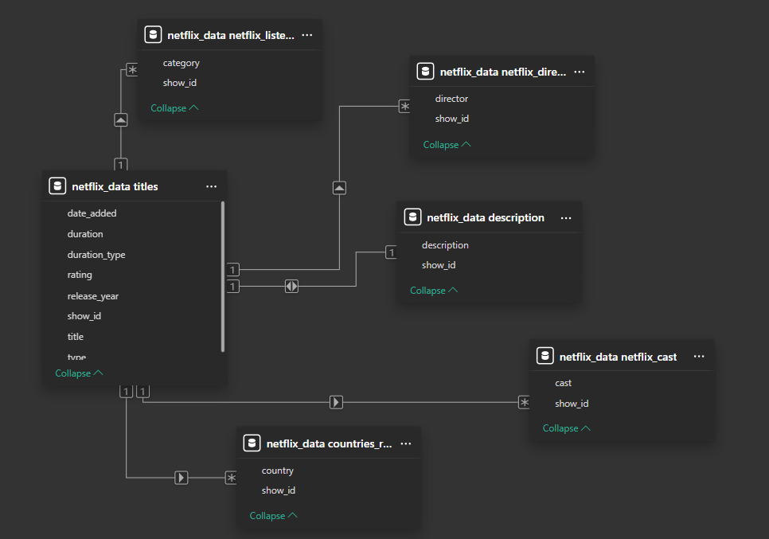
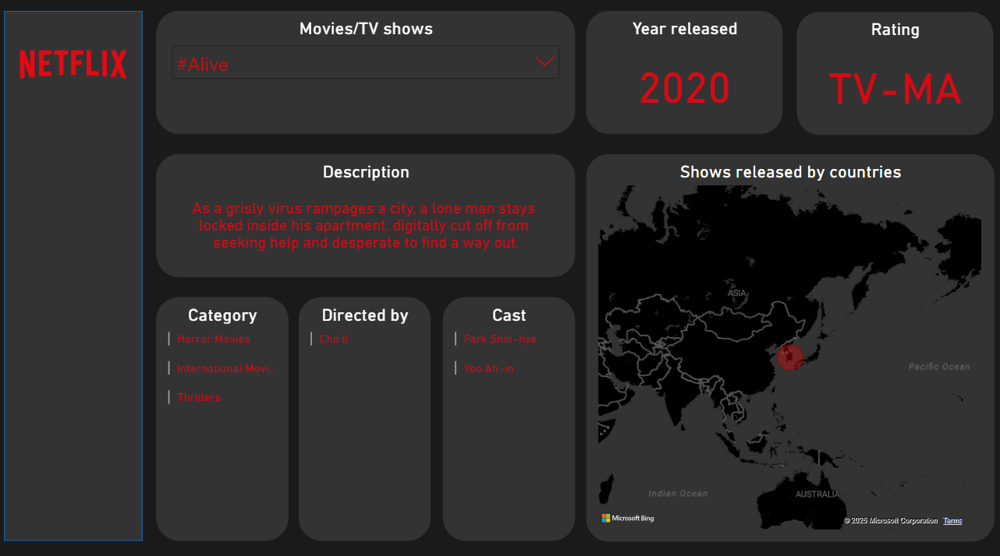
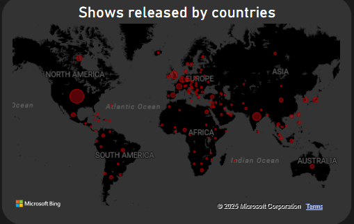

# 🎬 Netflix BI Dashboard  
An interactive Power BI dashboard that analyzes Netflix’s global content catalog — including **movies, TV shows, genres, ratings, release trends, and country-level distribution**.

This project provides a visually rich and business-focused understanding of content production and release behavior on Netflix.

---

## 📌 Business Objective

The goal of this project is to help content & strategy teams answer:

- How is Netflix expanding its library over time?
- What types of shows (Movies vs TV Shows) dominate the platform?
- Which content ratings are most common?
- What genres does Netflix prioritize?
- Which countries produce the most content?
- For any selected movie/TV show:
  - What is its description?
  - Who directed it?
  - Who are the cast members?
  - What categories does it belong to?

The dashboard is designed for **quick insights + detailed show-level exploration**.

---

## 🧩 Dataset

Source: Kaggle – *Netflix Movies and TV Shows Dataset*

Files used:

| File | Purpose |
|------|---------|
| `titles.csv` | Core dataset with titles, year, rating, duration, type |
| `listed_in.csv` | Categories / genres |
| `cast.csv` | Actor names for each show |
| `country.csv` | Country where the show was produced |
| `description.csv` | Show summary |

### 🔧 Excel Pre-processing
Because the dataset was split across multiple CSV files, Excel was used to:

- Clean missing values  
- Normalize inconsistent text fields  
- Combine datasets using `show_id`  
- Prepare a final merged dataset for Power BI  

---

## 🛠️ Tech Stack

- **Power BI Desktop**
  - Data modeling
  - Relationship creation using `show_id`
  - Custom visuals + map charts  
- **Microsoft Excel**
  - Data cleaning
  - Combining multiple CSV files
- **GitHub**
  - Documentation
  - Version control

---

## 🗂️ Data Model

The Power BI model uses **1-to-many relationships** with `show_id` as the key:
```
titles (main table)
│── listed_in (genres)
│── director table
│── cast table
│── description
└── country table
```

> This star-schema–like structure supports **clean filtering** across all dashboard visuals.



---

## 📊 Power BI Dashboard – Pages & Insights

---

### **📄 Page 1 – Show Details Viewer**

A full **show-level profile** UI:

#### 🔎 Search box
Select any movie/TV show (e.g., `#Alive`, Money Heist, Stranger Things).

#### 📝 Show Information Card
- **Year Released**
- **Rating**
- **Description**

#### 🧩 Categorization Panels
- Category (genre)
- Directed by
- Cast list

#### 🌍 Shows Released by Countries (map)
- Highlights which countries released **that particular show**
- Red bubbles sized by count

#### **Screenshot:**


---

### **📄 Page 2 – Netflix Global Insights Dashboard**

A business-level overview of Netflix's entire catalog.

#### **Screenshot:**

---

### 🎞️ **1. Shows Added by Date**
- Bar chart showing content count for each rating  
- **TV-MA** is the most frequent rating  
- Family-safe ratings show expected lower volume  


---

### 🌐 **2. Shows Released by Countries**
- Interactive world map  
- Large clusters in:
  - USA  
  - India  
  - UK  
  - South Korea  
  - Japan  



---

### 🎭 **3. Top 10 Genres**
- Ranked bar chart showing genre popularity  
- Most dominant:
  - International Movies  
  - Dramas  
  - Comedies  
  - Documentaries  


---

### 🎞️ **4. Shows Added by Rating**
- Bar chart showing content count for each rating  
- **TV-MA** is the most frequent rating  
- Family-safe ratings show expected lower volume  


---

## 🧾 Key Features

✔ Interactive show search  
✔ Dynamic filtering across director, cast, category  
✔ World map visual for content distribution  
✔ Time trend & rating-wise analytics  
✔ Genre-level insights  
✔ No DAX — clean visual modeling approach  
✔ Excel-based data transformation  

## 📁 Project Structure
```
Netflix-BI/
│
├── PowerBI/ → Dashboard PBIX (only snapshots)
├── excel/ → Cleaned & merged dataset (too large to include in github)
├── screenshots/ → Images for README
└── README.md
```
## ⭐ Outcome

This dashboard helps stakeholders and content analysts:

- Understand global content trends  
- Identify genre opportunities  
- Find regional strengths  
- Analyze content maturity (ratings & release years)  
- Explore individual titles in rich detail  
